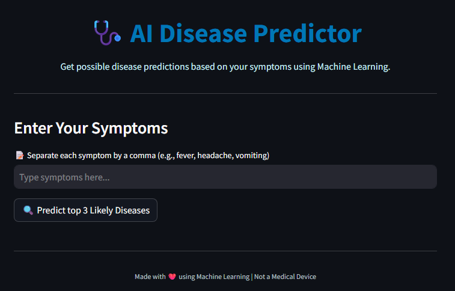
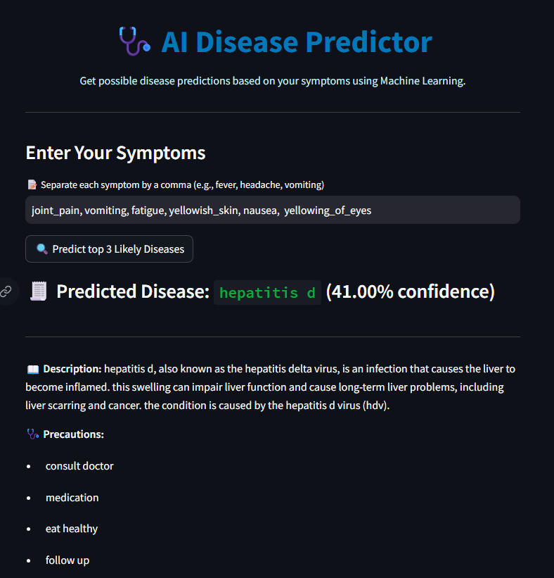
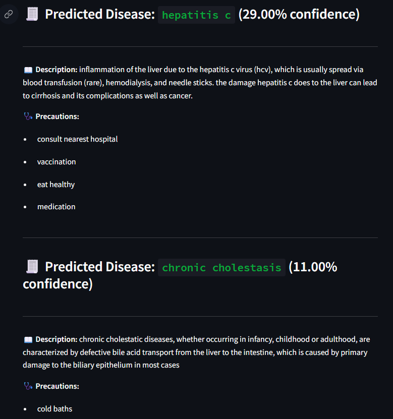

# 🩺 AI Disease Predictor

Get possible disease predictions based on your symptoms using Machine Learning.  
This web app takes a list of symptoms as input and suggests the **top 3 possible diseases**, along with their **descriptions** and **precautions**.

---

## 💡 Problem Statement

In regions with limited access to healthcare professionals, getting a timely diagnosis can be challenging.  
This app aims to provide an AI-based **preliminary disease prediction** based on user-provided symptoms.  
> ⚠️ It is **not a replacement** for medical diagnosis but a **supportive awareness tool**.

---

## 🛠️ Tools Used

| Tool            | Purpose                              |
|-----------------|---------------------------------------|
| 🐍 Python        | Core programming language             |
| 💻 Streamlit     | Web app frontend                      |
| 🤖 scikit-learn  | Machine Learning model                |
| 📦 Joblib        | Saving and loading trained models     |
| 📊 Pandas        | Data handling and preprocessing       |

---
<!-- 
## 📌 Try the Live Demo Here

[🔗 AI Disease Predictor App](https://)

--- -->

## 🧠 Model Description

The app uses a **multi-class classification model** trained on a structured symptom-to-disease dataset.

- **Input**: A binary-encoded vector of selected symptoms  
- **Model Logic**: Uses `predict_proba()` to return probabilities  
- **Output**: Top 3 predicted diseases with confidence and metadata  
- **Metadata**: Includes disease description and list of precautions  

---

## 📈 Accuracy Score

- The model achieves an **approximate accuracy of 94%** on the validation set.  
- ⚠️ Since symptoms often overlap between conditions, predictions should be considered as **indicative only**.

---

## 🚀 How to Run Locally

### ✅ Prerequisites

- Python 3.7+
- pip installed

### 📥 Clone the Repository

```bash
git clone https://github.com/Pratham-Dabhane/.git
cd your-project-folder
```
### 📦 Install Dependencies
```bash
pip install -r requirements.txt

```
### 🏃 Run the App
```bash
streamlit run app.py
```
---

## 📁 Project Directory Structure

```
📁 AI-Disease-Predictor/
│
├── app.py
├── requirements.txt
├── runtime.txt
├── README.md
|
├── data/
│ ├── dataset.csv
│ ├── processed.csv
│ ├── Symptom_Description.csv
│ ├── Symptom_precaution.csv
│ └── Symptom_Severity.csv
|
├── model/
│ ├── disease_predictor_model.joblib
│ └── meta/
│ ├── label_encoder.pkl
│ ├── symptom_list.pkl
│ └── disease_metadata.pkl
|
└── screenshots/
  └── screenshot.jpeg
```

---
### 🌟 Features

- 📝 Accepts comma-separated symptom inputs for easy user experience

- 🤖 Predicts top 3 possible diseases with confidence scores

- 📖 Displays disease descriptions and recommended precautions

- ⚠️ Includes a clear disclaimer emphasizing it's not a medical tool
---

### 🖼️ Screenshot


- Basic Web Page 



- Predictions



---

### 🙌 Acknowledgements
- [Disease Symptom Prediction Dataset](https://www.kaggle.com/datasets/itachi9604/disease-symptom-description-dataset)

- Streamlit community and docs

---

### ✨ Author

- **Pratham Dabhane**

- ✅ [Github/Pratham_Dabhane](https://github.com/Pratham-Dabhane)
---

### ⚠️ Disclaimer

This tool is for educational purposes only. It is not a certified medical device or diagnostic tool. Always consult a doctor for any serious or persistent symptoms.

---

### ❤️ Made with ML

Designed with care to demonstrate the power of Machine Learning in healthcare.

---